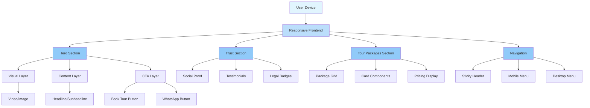
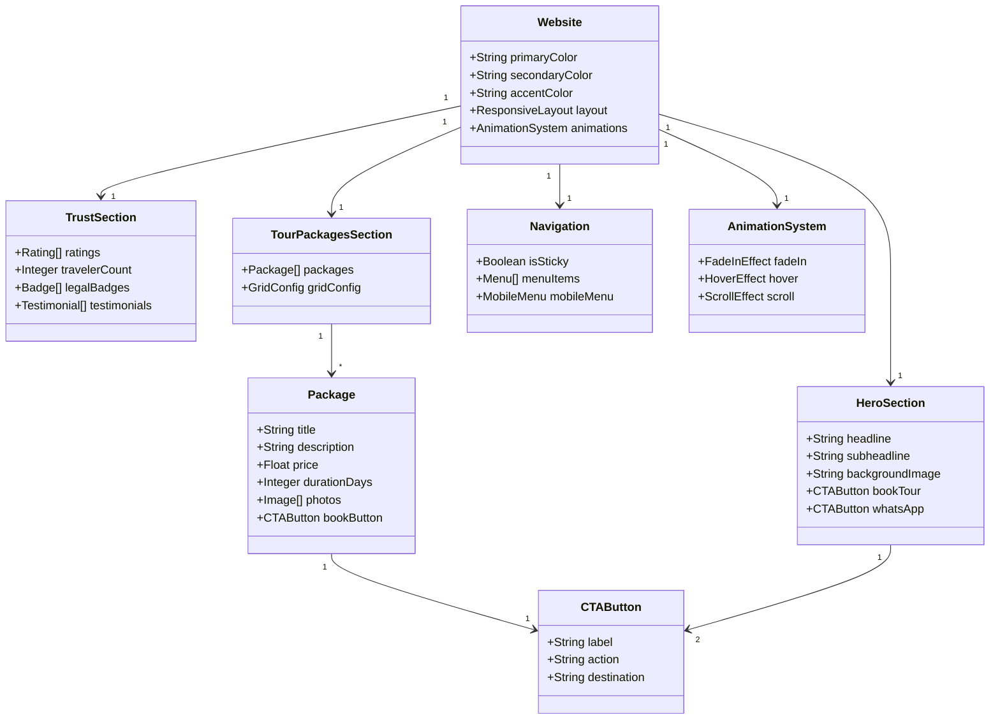
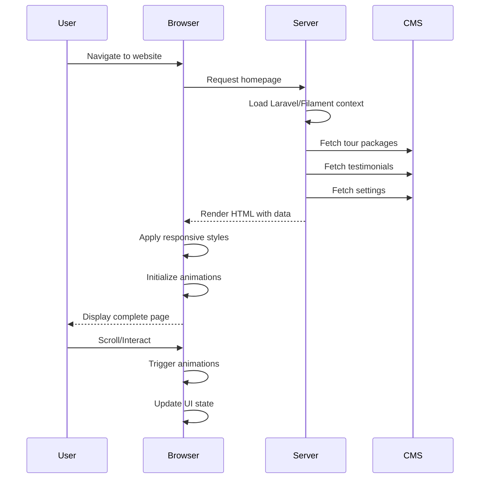

# Design Document: Modern Travel Website Redesign

## Overview

This design addresses the requirements for a modern, minimal, and professional travel website redesign. The website will be built on the existing Laravel/Filament platform, leveraging current features while implementing a comprehensive visual and UX overhaul. The design focuses on creating a visually comfortable, easy-to-use experience that showcases destination visuals through large, sharp photography while maintaining clear information architecture.

The design follows a mobile-first approach with progressive enhancement for larger screens, ensuring the website is usable on all devices while maintaining a professional, elegant aesthetic.

## Architecture

### High-Level Architecture



### Component Architecture



### Data Flow



## Components and Interfaces

### Hero Section Component

**Purpose**: Display the primary landing area with compelling messaging and clear CTAs

**Properties**:
- `headline`: String - Main headline text
- `subheadline`: String - Supporting subheadline text
- `backgroundImage`: String - URL to hero image or video source
- `isVideo`: Boolean - Whether background is video or image
- `ctaBookTour`: CTAButton - Primary booking button
- `ctaWhatsApp`: CTAButton - WhatsApp contact button

**Behavior**:
- Fullscreen display on desktop (min-height: 100vh)
- Auto-adjust height on mobile based on content
- Smooth fade-in on page load
- Parallax scrolling effect on desktop
- Responsive image loading based on device

**Responsive Behavior**:
- Desktop: Fullscreen with centered content
- Tablet: 80vh height with adjusted spacing
- Mobile: 60vh height with stacked content

### Trust Section Component

**Purpose**: Build credibility through social proof and testimonials

**Properties**:
- `ratings`: Rating[] - Customer rating data
- `travelerCount`: Integer - Total travelers served
- `legalBadges`: Badge[] - Certifications and badges
- `testimonials`: Testimonial[] - Customer testimonials

**Data Structures**:
```typescript
interface Rating {
  platform: string;
  score: number;
  count: number;
}

interface Badge {
  name: string;
  icon: string;
  description: string;
}

interface Testimonial {
  name: string;
  location: string;
  text: string;
  rating: number;
}
```

### Tour Packages Section Component

**Purpose**: Showcase available tour packages with clear visual information

**Properties**:
- `packages`: Package[] - Array of tour packages
- `gridColumns`: Integer - Number of columns in grid
- `cardStyle`: CardStyle - Visual style for package cards

**Data Structures**:
```typescript
interface Package {
  id: string;
  title: string;
  description: string;
  price: number;
  durationDays: number;
  destination: string;
  photos: Image[];
  features: Feature[];
}

interface Image {
  src: string;
  alt: string;
  width: number;
  height: number;
}

interface Feature {
  name: string;
  icon: string;
}
```

**Grid Configuration**:
- Desktop: 3 columns
- Tablet: 2 columns
- Mobile: 1 column

### Navigation Component

**Purpose**: Provide consistent site navigation with responsive behavior

**Properties**:
- `isSticky`: Boolean - Whether header stays visible on scroll
- `menuItems`: MenuItem[] - Navigation menu items
- `logo`: Logo - Website logo

**Data Structures**:
```typescript
interface MenuItem {
  label: string;
  url: string;
  isActive: boolean;
}

interface Logo {
  src: string;
  alt: string;
  width: number;
  height: number;
}
```

**Behavior**:
- Sticky positioning on scroll
- Mobile menu toggle on small screens
- Active state highlighting for current page
- Smooth scroll to anchor links

### Animation System

**Purpose**: Provide smooth, professional animations throughout the site

**Properties**:
- `fadeIn`: FadeInConfig - Fade-in animation settings
- `hover`: HoverConfig - Hover effect settings
- `scroll`: ScrollConfig - Scroll behavior settings

**Configuration**:
```typescript
interface AnimationConfig {
  duration: number; // milliseconds
  easing: string; // CSS easing function
  delay: number; // milliseconds
}

interface FadeInConfig extends AnimationConfig {
  threshold: number; // viewport threshold
  opacityStart: number;
  opacityEnd: number;
}

interface HoverConfig extends AnimationConfig {
  transform: string;
  scale: number;
}

interface ScrollConfig extends AnimationConfig {
  behavior: 'smooth' | 'auto';
  offset: number;
}
```

## Data Models

### Website Configuration

```typescript
interface WebsiteConfig {
  colors: {
    primary: string; // Elegant blue
    secondary: string; // White
    accent: string; // Light gray
  };
  typography: {
    headline: {
      family: string;
      weight: string;
      sizes: {
        desktop: string;
        tablet: string;
        mobile: string;
      };
    };
    body: {
      family: string;
      weight: string;
      sizes: {
        desktop: string;
        tablet: string;
        mobile: string;
      };
    };
  };
  spacing: {
    base: number; // Base spacing unit
    scale: number[]; // Proportional spacing scale
  };
  animations: AnimationSystem;
}
```

### Tour Package Model

```typescript
interface TourPackage {
  id: string;
  title: string;
  slug: string;
  description: string;
  shortDescription: string;
  price: number;
  currency: string;
  durationDays: number;
  durationText: string;
  destination: string;
  destinationSlug: string;
  images: {
    hero: Image;
    gallery: Image[];
  };
  features: Feature[];
  itinerary: ItineraryItem[];
  inclusions: string[];
  exclusions: string[];
  availability: Availability[];
  meta: {
    title: string;
    description: string;
    keywords: string[];
  };
}
```

### User Interaction Model

```typescript
interface UserInteraction {
  type: 'click' | 'scroll' | 'hover' | 'touch';
  element: string;
  timestamp: number;
  duration?: number;
  coordinates?: {
    x: number;
    y: number;
  };
}
```

## Correctness Properties

A property is a characteristic or behavior that should hold true across all valid executions of a system-essentially, a formal statement about what the system should do. Properties serve as the bridge between human-readable specifications and machine-verifiable correctness guarantees.

### Property-Based Testing Overview

Property-based testing (PBT) validates software correctness by testing universal properties across many generated inputs.
Each property is a formal specification that should hold for all valid inputs.

#### Core Principles

1. **Universal Quantification**: Every property must contain an explicit "for all" statement
2. **Requirements Traceability**: Each property must reference the requirements it validates
3. **Executable Specifications**: Properties must be implementable as automated tests
4. **Comprehensive Coverage**: Properties should cover all testable acceptance criteria

#### Common Property Patterns

1. **Invariants**: Properties that remain constant despite changes to structure or order
2. **Round Trip Properties**: Combining an operation with its inverse to return to original value
3. **Idempotence**: Operations where doing it twice equals doing it once
4. **Metamorphic Properties**: Relationships between components without knowing specific values
5. **Model Based Testing**: Optimized implementation vs standard implementation
6. **Confluence**: Order of operations doesn't matter
7. **Error Conditions**: Generating bad inputs and ensuring proper error signaling

### Correctness Properties

**Property 1: Hero section displays fullscreen on desktop**
*For any* page load on desktop devices (screen width ≥ 1024px), the hero section SHALL have a minimum height of 100vh and display a large, sharp travel photograph or video as background
**Validates: Requirements 1.1, 1.5**

**Property 2: Headline and subheadline always display together**
*For any* page with a hero section, if a headline is displayed, a subheadline MUST also be displayed below it with appropriate spacing
**Validates: Requirements 1.2, 1.3**

**Property 3: Both CTA buttons are always present in hero section**
*For any* page with a hero section, both "Book Tour" and "Chat WhatsApp" CTA buttons MUST be visible and functional
**Validates: Requirements 1.4**

**Property 4: Trust section always displays all required elements**
*For any* trust section, customer ratings, traveler count, legal badges, and testimonials MUST all be displayed
**Validates: Requirements 2.1, 2.2, 2.3, 2.4**

**Property 5: Tour packages always display complete information**
*For any* tour package card, the following elements MUST be present: large photo, clear pricing, trip duration, and action button
**Validates: Requirements 3.1, 3.2, 3.3, 3.4**

**Property 6: Navigation maintains sticky behavior during scroll**
*For any* page scroll action, the navigation header MUST remain visible at the top of the viewport
**Validates: Requirements 4.1**

**Property 7: Navigation menu never exceeds 5 items**
*For any* page load, the main navigation menu MUST contain 5 or fewer items
**Validates: Requirements 4.2**

**Property 8: Mobile navigation uses appropriate UI pattern**
*For any* page load on mobile devices (screen width < 768px), the navigation MUST use a hamburger menu pattern
**Validates: Requirements 4.3**

**Property 9: Touch targets meet minimum size requirements on mobile**
*For any* interactive element on mobile devices, the touch target area MUST be at least 44x44 pixels
**Validates: Requirements 5.1**

**Property 10: Text meets minimum readability thresholds on mobile**
*For any* text element on mobile devices, the font size MUST be at least 16px for body text and 24px for headlines
**Validates: Requirements 5.2**

**Property 11: Spacing between interactive elements is adequate on mobile**
*For any* two adjacent interactive elements on mobile devices, the spacing MUST be at least 8 pixels
**Validates: Requirements 5.3**

**Property 12: CTA buttons remain accessible during mobile scroll**
*For any* scroll action on mobile devices, at least one CTA button MUST remain visible in the viewport
**Validates: Requirements 5.4**

**Property 13: All elements use fade-in animation on viewport entry**
*For any* element entering the viewport, a fade-in animation MUST be applied with configurable duration and easing
**Validates: Requirements 6.1**

**Property 14: Hover effects use smooth transitions**
*For any* interactive element on desktop, hover state changes MUST use smooth CSS transitions
**Validates: Requirements 6.2**

**Property 15: Page scrolling uses smooth behavior**
*For any* scroll action, the scrolling behavior MUST use smooth easing rather than instant jumps
**Validates: Requirements 6.3**

**Property 16: Primary color is used consistently for all primary elements**
*For any* page section, the primary color (elegant blue) MUST be used for headlines, buttons, and other primary elements
**Validates: Requirements 7.1**

**Property 17: Background colors follow the specified palette**
*For any* page section, backgrounds MUST use white or light gray combinations as specified
**Validates: Requirements 7.2**

**Property 18: Typography hierarchy is maintained throughout**
*For any* text element, headlines MUST use bold font weight and body text MUST use light font weight
**Validates: Requirements 7.3, 7.4, 7.5**

**Property 19: Grid system maintains proportional spacing**
*For any* layout element, spacing MUST follow the consistent grid system with proportional values
**Validates: Requirements 7.6**

**Property 20: Images are optimized for the current device**
*For any* image on any device, the image source MUST be appropriately sized for the screen dimensions
**Validates: Requirements 8.5**

**Property 21: Layout adapts gracefully to screen size changes**
*For any* screen size change event, the layout MUST adapt without breaking elements or causing overflow
**Validates: Requirements 8.4**

**Property 22: Hero section loads within performance threshold**
*For any* page load on standard mobile connections, the hero section MUST be fully displayed within 3 seconds
**Validates: Requirements 9.1**

**Property 23: Images use optimized formats and lazy loading**
*For any* image element, the image MUST use an optimized format (WebP or AVIF when supported) and implement lazy loading
**Validates: Requirements 9.2**

**Property 24: Animations do not block page rendering**
*For any* animation on page load, the animation MUST NOT block the main thread or delay content display
**Validates: Requirements 9.3**

**Property 25: Scroll performance maintains 60fps**
*For any* scroll action, the scrolling MUST maintain a minimum of 60 frames per second
**Validates: Requirements 9.4**

**Property 26: All images include appropriate alt text**
*For any* image element, the alt attribute MUST be present and contain descriptive text
**Validates: Requirements 10.1**

**Property 27: Interactive elements are keyboard navigable**
*For any* interactive element, the element MUST be reachable and usable via keyboard navigation
**Validates: Requirements 10.2**

**Property 28: Text meets WCAG contrast requirements**
*For any* text element, the contrast ratio between text and background MUST meet WCAG AA standards (4.5:1 for normal text)
**Validates: Requirements 10.3**

**Property 29: Focus indicators are visible on all interactive elements**
*For any* interactive element, a clear focus indicator MUST be displayed when the element receives keyboard focus
**Validates: Requirements 10.4**

**Property 30: DOM order matches visual order**
*For any* page layout, the DOM element order MUST match the visual reading order for screen reader accessibility
**Validates: Requirements 10.5**

## Error Handling

### Navigation Errors

**Error**: Navigation menu fails to load
**Handling**: Display fallback menu with basic site links, log error for monitoring

### Image Loading Errors

**Error**: Hero image or package photo fails to load
**Handling**: Display placeholder image with error icon, log error for monitoring

### Animation Errors

**Error**: Animation fails to complete or causes layout shift
**Handling**: Gracefully degrade to static display, log error for monitoring

### Responsive Layout Errors

**Error**: Layout breaks on specific screen sizes
**Handling**: Implement fallback styles for common breakpoints, use CSS containment

### Performance Errors

**Error**: Page load exceeds performance threshold
**Handling**: Implement progressive enhancement, lazy load non-critical resources

## Testing Strategy

### Dual Testing Approach

This design requires both unit testing and property-based testing for comprehensive coverage. Unit tests verify specific examples and edge cases, while property tests verify universal properties across all inputs. Both approaches are necessary and complementary.

### Property-Based Testing Configuration

**Library Selection**: For this Laravel/Filament project, we will use **phpspec/prophecy** for PHP property-based testing, combined with **PHPUnit** for unit tests.

**Test Configuration**:
- Minimum 100 iterations per property test
- Each property test references its design document property
- Tag format: **Feature: travel-website-redesign, Property {number}: {property_text}**

### Unit Testing Strategy

Unit tests will focus on:
- Specific examples that demonstrate correct behavior
- Integration points between components
- Edge cases and error conditions
- Data model validation
- Animation configuration validation

### Property Testing Strategy

Property tests will verify:
- Universal properties that hold for all inputs
- Comprehensive input coverage through randomization
- Layout consistency across screen sizes
- Animation behavior across different states
- Accessibility compliance across content variations

### Test Coverage Requirements

- **Unit Tests**: 80%+ code coverage
- **Property Tests**: All 30 correctness properties implemented
- **Integration Tests**: Key user flows covered
- **Accessibility Tests**: WCAG 2.1 AA compliance verified

### Test Implementation Examples

**Property Test Template**:
```php
/**
 * @test
 * Feature: travel-website-redesign, Property 1: Hero section displays fullscreen on desktop
 * Validates: Requirements 1.1, 1.5
 */
public function hero_section_displays_fullscreen_on_desktop()
{
    $this->propertyTest()
        ->forAll(DesktopPageGenerator::class)
        ->assert(function (DesktopPage $page) {
            $this->assertTrue($page->getHeroSection()->getHeight() >= 100vh);
            $this->assertTrue($page->getHeroSection()->hasValidBackground());
        });
}
```

**Unit Test Example**:
```php
/** @test */
public function it_displays_both_cta_buttons_in_hero_section()
{
    $hero = new HeroSection(
        headline: 'Explore the World',
        subheadline: 'Your adventure begins here',
        ctaBookTour: new CTAButton('Book Tour', '/tours'),
        ctaWhatsApp: new CTAButton('Chat WhatsApp', 'https://wa.me/...')
    );
    
    $this->assertTrue($hero->hasBookTourButton());
    $this->assertTrue($hero->hasWhatsAppButton());
}
```

### Accessibility Testing

- Automated WCAG compliance checks using **spatie/phpunit-warnings**
- Manual keyboard navigation testing
- Screen reader compatibility verification
- Color contrast ratio validation

### Performance Testing

- Lighthouse CI integration for performance metrics
- Core Web Vitals monitoring
- Mobile performance testing on various network conditions